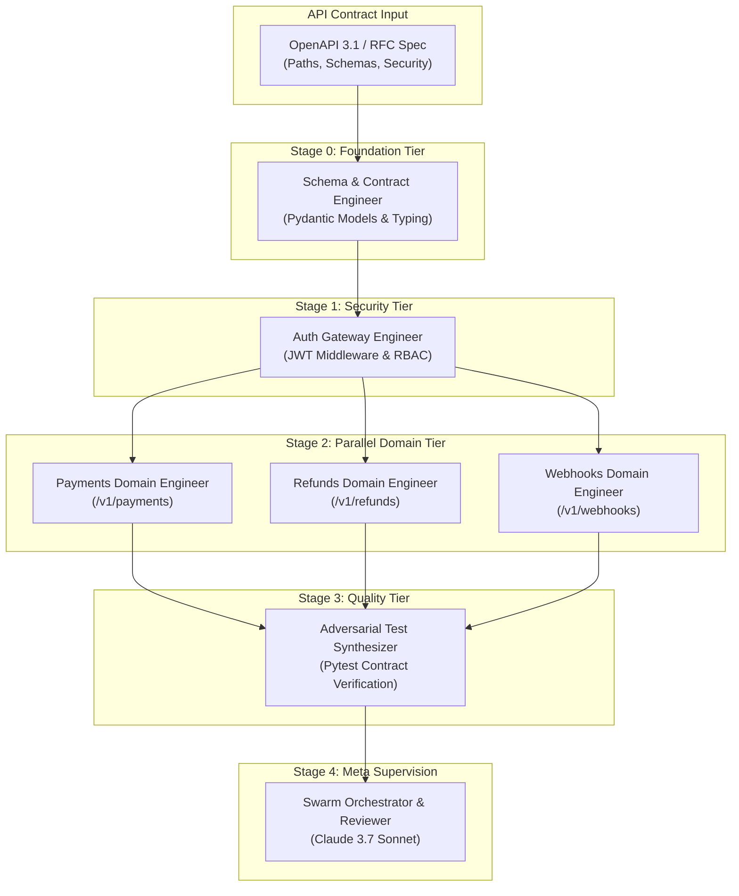
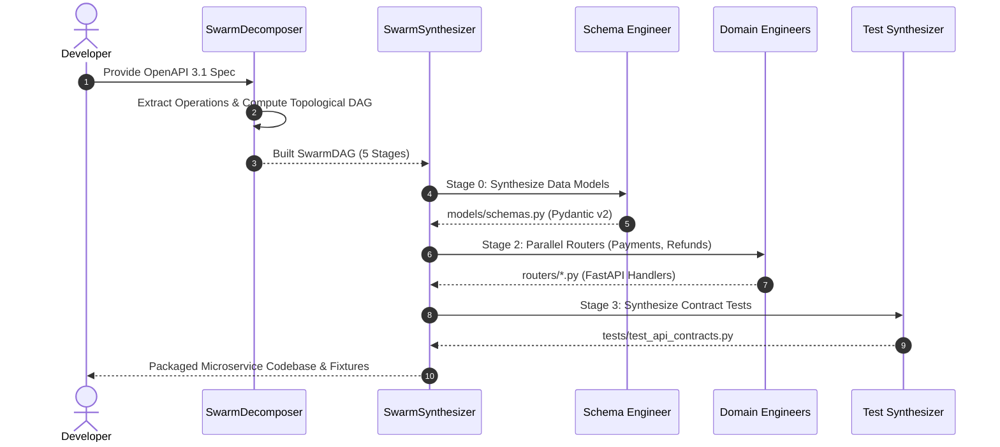
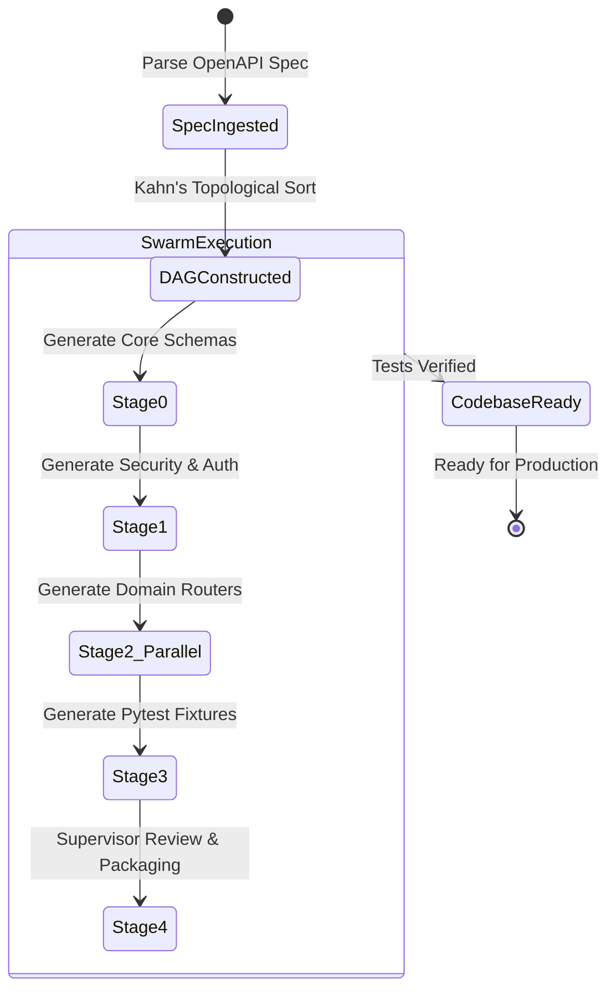

# 🐝 Spec-To-Swarm

> **Self-Assembling Autonomous Micro-Agent Swarm from an OpenAPI 3.1 or RFC Specification**  
> *Engineered for Multi-Agent Orchestration with Claude 3.7 Sonnet, OpenAI o3, and Gemini 2.5 Pro.*

[](https://opensource.org/licenses/Apache-2.0)
[](https://python.org)
[](https://spec.openapis.org/oas/latest.html)
[]()
[]()

---

## ⚡ The Problem: The Multi-Agent Setup Bottleneck

Configuring autonomous multi-agent teams is manual, brittle, and tedious:
- Developers spend days writing custom system prompts, setting up inter-agent messaging channels, hand-crafting JSON schemas, and deciding which agent should call which tool.
- Single monolithic coding agents often hallucinate schema fields, lose track of auth requirements, or fail on edge-case integrations.

Meanwhile, enterprise development **already starts with an API specification** (OpenAPI 3.1 YAML/JSON or Markdown RFC).

**Spec-To-Swarm** automates this entirely. Feed it an API spec, and it autonomously:
1. **Decomposes** the specification into a **Directed Acyclic Graph (DAG)** of specialized micro-agents (*Schema Architect*, *Security Gateway Engineer*, *Domain Handlers*, *Adversarial Test Synthesizer*, and *Supervisor*).
2. **Synthesizes** tailored system prompts, endpoint scopes, and MCP tool definitions for each agent tier.
3. **Orchestrates** parallel execution across topological tiers to generate complete, tested backend microservices in seconds.

---

## 📐 Swarm Architecture & Topological DAG

### 1. Self-Assembling Micro-Agent DAG



---

### 2. Multi-Agent Execution & Synthesis Sequence



---

### 3. Agent Lifecycle & Delivery Pipeline



---

## 🚀 Quick Start

### Installation

```bash
git clone https://github.com/AAH20/spec-to-swarm.git
cd spec-to-swarm
pip install -e .
```

### Run Autonomous Swarm Synthesis Demo

Watch `spec-to-swarm` parse a sovereign payments API spec, assemble 7 specialized micro-agents into a 5-stage DAG, and synthesize the entire backend codebase:

```bash
spec-to-swarm demo
```

Output:
```text
============================================================================
  🐝 SPEC-TO-SWARM: AUTONOMOUS MICRO-AGENT DECOMPOSITION FROM OPENAPI
  Frontier Multi-Agent Engine: Claude 3.7 Sonnet | OpenAI o3 | Gemini 2.5 Pro
============================================================================
✓ Parsed OpenAPI Specification: 'HyperPay Sovereign Payments Engine' v2.4.0
✓ Extracted 4 API operations across 3 functional domains.

----------------------------------------------------------------------------
[1/3] Decomposing API Contract into Micro-Agent Directed Acyclic Graph (DAG)
----------------------------------------------------------------------------
• Total Autonomous Micro-Agents: 7
• Topological Execution Tiers  : 5 Stages

  Stage 0 (Parallel): Schema & Contract Engineer
  Stage 1 (Parallel): Auth & Security Gateway Engineer
  Stage 2 (Parallel): Payments Domain Engineer, Refunds Domain Engineer, Webhooks Domain Engineer
  Stage 3 (Parallel): Adversarial Test & Fixture Synthesizer
  Stage 4 (Parallel): Swarm Orchestrator & Code Reviewer

----------------------------------------------------------------------------
[2/3] Synthesizing Specialized System Prompts & Tool Contracts
----------------------------------------------------------------------------
• Synthesized Prompt for: [SCHEMA_ENGINEER] Schema & Contract Engineer
    # Role: Schema & Contract Engineer (schema_engineer)
    # Swarm Target: HyperPay Sovereign Payments Engine v2.4.0
    # Target Domain: core_models

----------------------------------------------------------------------------
[3/3] Executing Micro-Agent Swarm Code Synthesis Pipeline
----------------------------------------------------------------------------
✓ [Schema & Contract Engineer] -> Generated: models/schemas.py (42.5ms)
✓ [Auth & Security Gateway Engineer] -> Generated: core/auth.py (28.1ms)
✓ [Payments Domain Engineer] -> Generated: routers/payments_router.py (35.0ms)
✓ [Refunds Domain Engineer] -> Generated: routers/refunds_router.py (35.0ms)
✓ [Webhooks Domain Engineer] -> Generated: routers/webhooks_router.py (35.0ms)
✓ [Adversarial Test & Fixture Synthesizer] -> Generated: tests/test_api_contracts.py (50.2ms)

============================================================================
  SWARM ASSEMBLED & COMPLETE BACKEND CODEBASE GENERATED IN 5.1ms
============================================================================
```

---

## 🧪 Testing

```bash
python3 -m unittest discover -s tests -p "test_*.py" -v
```

```text
test_parser_extraction ... ok
test_prompt_and_code_synthesis ... ok
test_swarm_dag_topology ... ok

Ran 3 tests in 0.000s
OK
```

---

## 📄 License

Apache License 2.0. Built for the modern autonomous AI engineering ecosystem.
